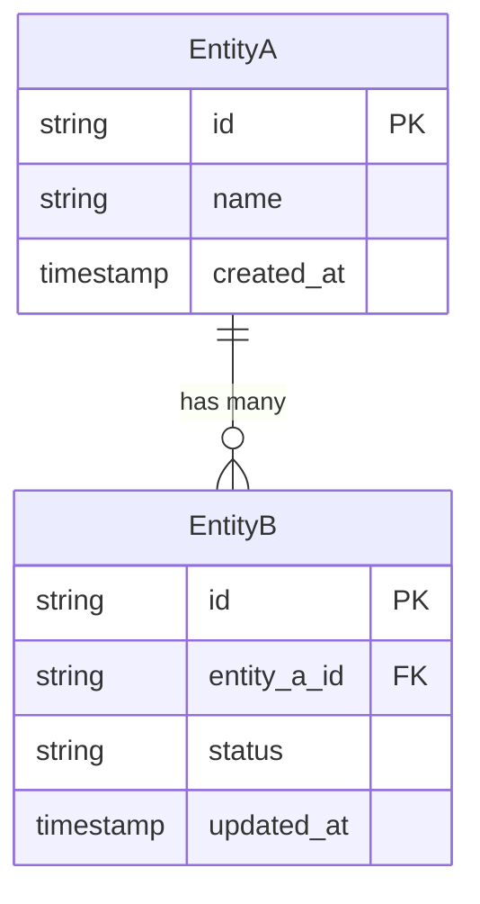

# Data Model Template

```md
# Data Model: {Feature Name}
**Status:** DRAFT | **Date:** {YYYY-MM-DD} | **PRD:** [PRD-{feature-name}](./PRD-{feature-name}.md)

## Overview

One paragraph: what data this model manages and why it exists.

## ER Diagram



## Entity Definitions

### EntityA

| Attribute | Type | Constraints | Description |
|-----------|------|-------------|-------------|
| id | string | PK | Unique identifier |
| name | string | NOT NULL | Display name |
| created_at | timestamp | NOT NULL, default now | Creation time |

### EntityB

| Attribute | Type | Constraints | Description |
|-----------|------|-------------|-------------|
| id | string | PK | Unique identifier |
| entity_a_id | string | FK → EntityA, NOT NULL | Parent reference |
| status | string | NOT NULL | Current status |
| updated_at | timestamp | NOT NULL | Last modification time |

## Access Patterns

Include when the PRD implies non-trivial query needs.

| Pattern | Description | Entities | Frequency |
|---------|-------------|----------|-----------|
| {Pattern name} | {What is being queried and why} | {Which entities} | {hot/warm/cold} |

## Indexes

Include when access patterns warrant them.

| Entity | Index | Columns | Rationale |
|--------|-------|---------|-----------|
| {Entity} | {Index name} | {column list} | {Which access pattern this serves} |

## Migration Strategy

Include when existing entities are being modified. Skip for greenfield.

| Step | Change | Backwards Compatible | Notes |
|------|--------|---------------------|-------|
| 1 | {What changes} | Yes/No | {Sequencing notes, backfill approach} |

## Denormalization / Derived Data

Include when performance requirements suggest pre-computed or duplicated data.

| Derived Field | Source | Rationale |
|---------------|--------|-----------|
| {Field} | {How it's computed} | {Why denormalization is warranted} |

## Open Questions

- {Anything unresolved that needs discussion}
```

## Rules

- ER diagrams: show entities, key attributes, and cardinality. Don't cram every column into the diagram — that's what the entity definition tables are for.
- Use abstract types (`string`, `integer`, `timestamp`, `boolean`, `json`). Not dialect-specific.
- Note the intended storage system if known, but don't write DDL.
- Access patterns drive index design — always pair them.
- Migration strategy: describe the approach (add nullable, backfill, add constraint), not the SQL.
- Use domain terms from `docs/CONTEXT.md` as entity and attribute names.
- Omit any optional section that doesn't add value for this specific model.
