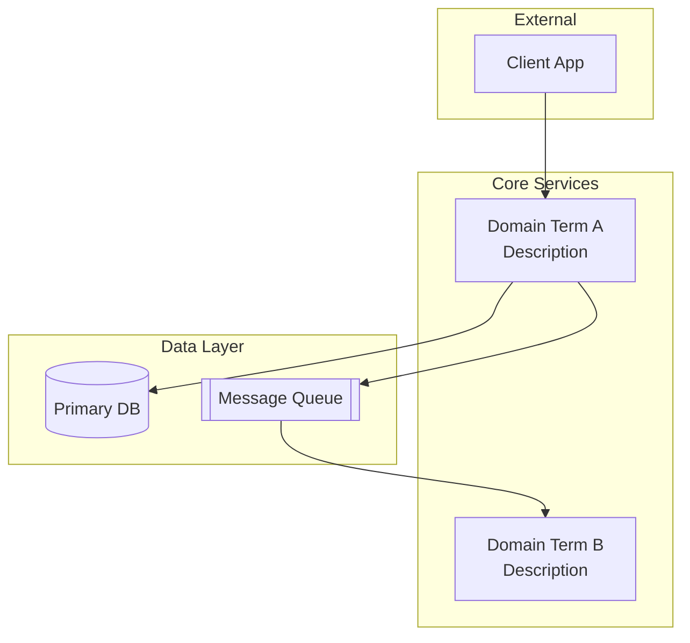
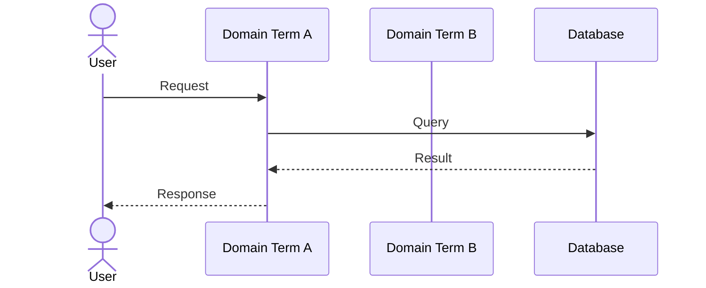
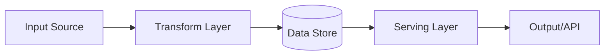

# System Design Template

```md
# System Design: {Feature Name}
**Status:** DRAFT | **Date:** {YYYY-MM-DD} | **PRD:** [PRD-{feature-name}](./PRD-{feature-name}.md)

## Overview

One paragraph: what this system does and why it exists.

## Component Diagram



## Key Flows

### Flow 1: {Primary Happy Path}



### Flow 2: {Secondary Flow}

(Another sequence diagram)

## Data Flow

Include when data moves through multiple stages or transforms.



## API Contracts

Include when the system exposes or consumes APIs.

### {Service Name} API

| Endpoint | Method | Description | Input | Output |
|----------|--------|-------------|-------|--------|
| /resource | POST | Create resource | {fields} | {response} |
| /resource/:id | GET | Get resource | id | {response} |

### Inter-Service Contracts

| From | To | Protocol | Payload |
|------|-----|----------|---------|
| {Service A} | {Service B} | Async (Queue) | {event schema} |

## Trade-off Analysis

Include when real alternatives were considered.

| Decision | Options Considered | Chosen | Why |
|----------|-------------------|--------|-----|
| {Decision 1} | A, B, C | B | {Reasoning} |

## Failure Modes

Include when the system has distributed components or external dependencies.

| Component | Failure | Impact | Mitigation |
|-----------|---------|--------|------------|
| {Component} | {What fails} | {User impact} | {How to handle} |

## Scalability Notes

Include when scale or performance requirements exist.

- **Current scale:** {expected load}
- **Bottlenecks:** {where it'll break first}
- **Scaling strategy:** {horizontal/vertical, sharding, caching}

## Open Questions

- {Anything unresolved that needs discussion}
```

## Rules

- Component diagrams: aim for 3-8 components. More = probably over-decomposed for this stage.
- Sequence diagrams: pick the 2-3 most important flows. Don't diagram everything.
- Trade-off analysis: always recommend one option. Don't be indecisive.
- Failure modes: focus on realistic failures, not theoretical edge cases.
- Use domain terms from `docs/CONTEXT.md` as diagram labels. Not "Service A" — use the real name.
- No file paths. No code snippets. Describe interfaces and behavior.
- Omit any optional section that doesn't add value for this specific system.
