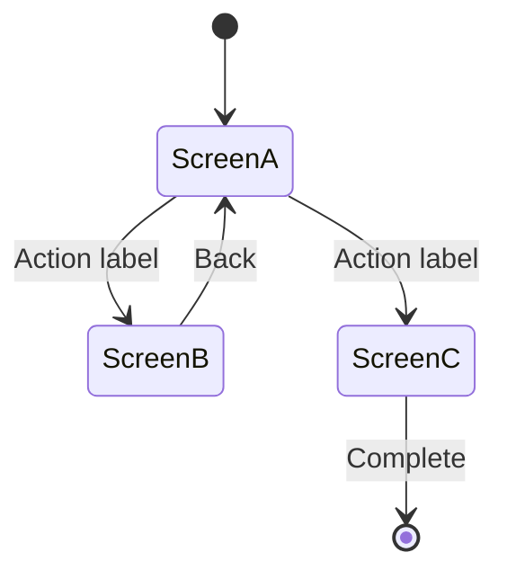

# UI Spec Template

```md
# UI Spec: {Feature Name}
**Status:** DRAFT | **Date:** {YYYY-MM-DD} | **PRD:** [PRD-{feature-name}](./PRD-{feature-name}.md)

## Overview

One paragraph: what the user experiences and the core interaction model.

## Navigation Flow



## Screens

### Screen A: {Screen Name}

**Purpose:** One line on what this screen does.

**Layout:**
Description of content areas and their arrangement (e.g., "header with title and back button, scrollable list of items, sticky footer with action button").

**Content:**
- {What data is displayed}
- {Where it comes from — which entity or data source}

**Actions:**
| Action | Element | Result |
|--------|---------|--------|
| {What the user does} | {Button, link, gesture} | {Where it leads or what it triggers} |

**States:**
| State | What the user sees |
|-------|-------------------|
| Loading | {Loading indicator description} |
| Empty | {Empty state message and any call-to-action} |
| Error | {Error presentation and recovery option} |
| Success | {Default populated view} |

### Screen B: {Screen Name}

(Same structure as above)

### Screen C: {Screen Name}

(Same structure as above)

## Shared Patterns

Include when multiple screens reuse the same layout pattern.

### {Pattern Name}

**Used in:** Screen A, Screen B

**Layout:** Description of the reusable pattern (e.g., "card with avatar on left, title and subtitle stacked on right, timestamp below subtitle, chevron on far right").

## Open Questions

- {Anything unresolved that needs discussion}
```

## Rules

- Navigation flow: use `stateDiagram-v2`. Label transitions with the user action that triggers them.
- Every screen gets all five subsections: purpose, layout, content, actions, states.
- States must cover loading, empty, error, and success at minimum. Add feature-specific states as needed (e.g., "no permissions", "quota exceeded").
- Stay technology-agnostic. "Screen", "list", "modal", "input field" — not "FlatList", "Dialog", "TextInput".
- Use domain terms from `docs/CONTEXT.md` for content descriptions.
- Omit Shared Patterns unless genuinely reused across screens.
